# University project ellen

Making a Java game for better learning java core.

- [x] OOP
- [x] Collections
- [x] Objects
- [x] StreamApi
- [x] Lambda
- [x] Generics

## Start game
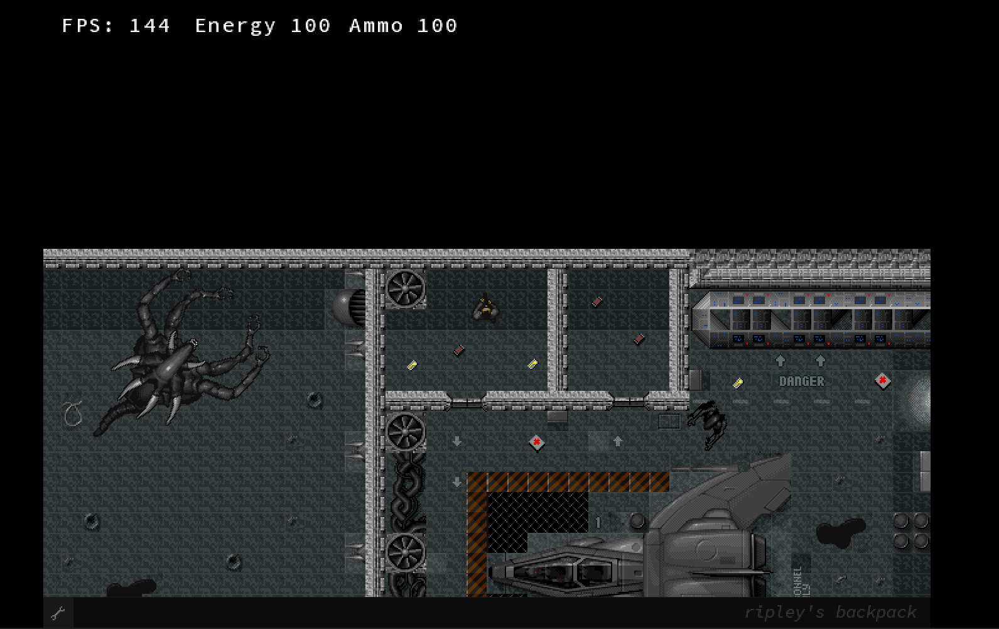

## Enemy
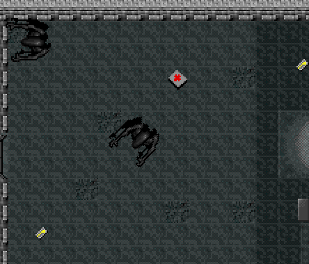

## Boss enemy
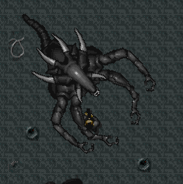

## Key for open door in next room
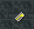

## Ammo for shooting
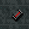

## Medicine
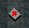

## Shooting in enemy
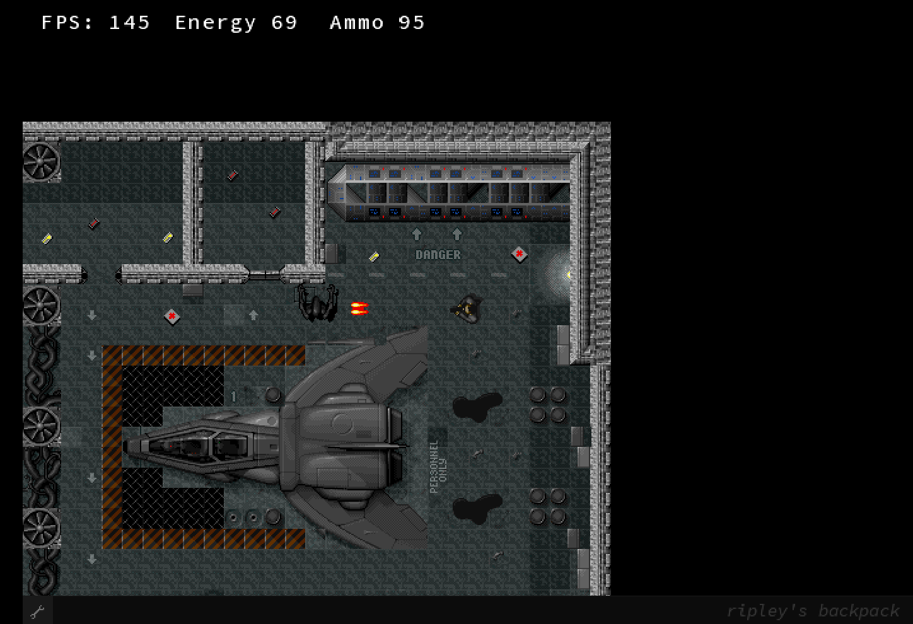

## Loose game

If you run out of energy, you lose the game.

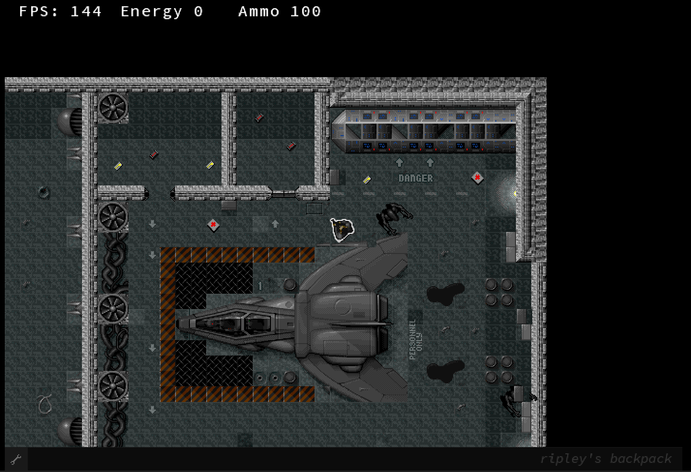

## Win game

You won the game when you didn't die and killed all the enemies.

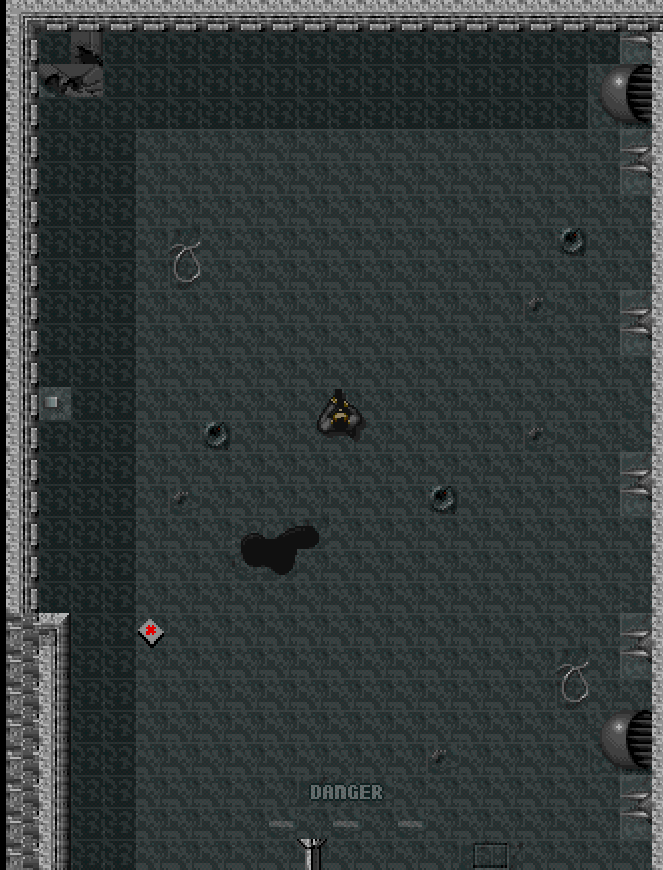

## Map 1
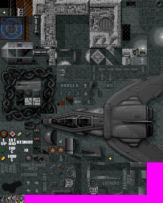

## Map 2
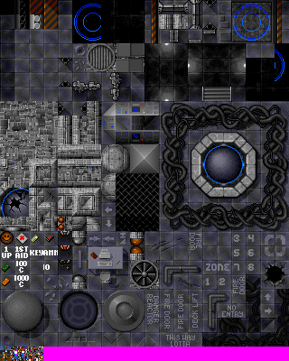
